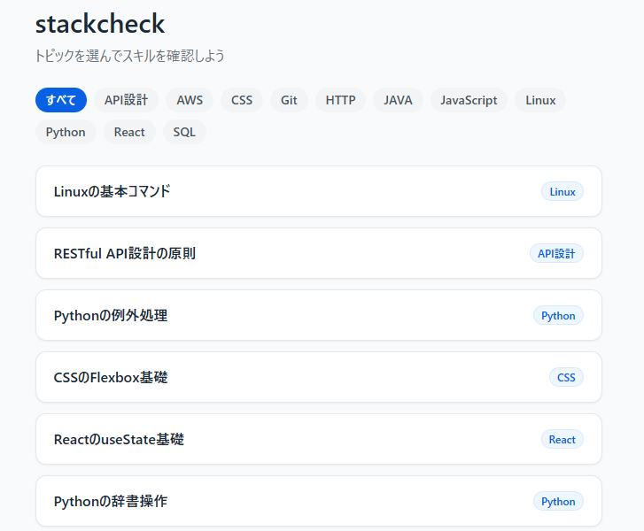
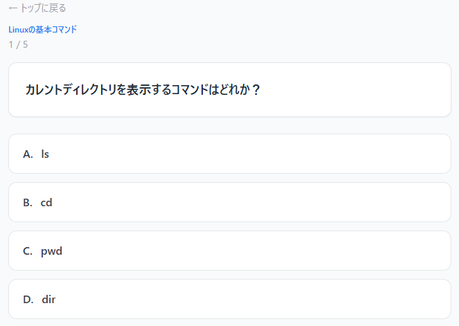
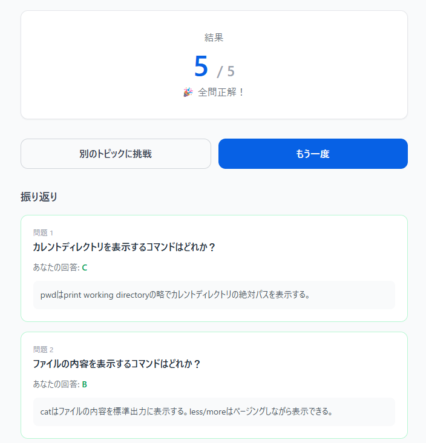

# stackcheck

**「学んだことを、確かめる。積み上げを、資産にする。」**

エンジニアが自分のスキルレベルを把握し、知識の定着と成長を実感できるクイズプラットフォーム。

🌐 **公開URL**: https://stackcheck-frontend.onrender.com/

---


---

## 解決する課題

エンジニアの学習には「インプット過多・アウトプット不足」という構造的な問題があります。

| 課題 | stackcheck での解決 |
|---|---|
| 書籍・記事を読んでも記憶に定着しない | 4択クイズで即座にアウトプット → 定着を促進 |
| 自分の弱点分野がわからない | トピック別に正答率を確認 → 苦手を可視化 |
| 学習ログの入力コストが高い | トピックを選ぶだけで開始 → 摩擦ゼロ |

---

## Screenshots

> ※ スクリーンショットは順次追加予定

| トップ画面（トピック一覧） | クイズ画面 | 結果画面 |
|---|---|---|
|  |  |  |

---

## 主な機能

- **トピック一覧・カテゴリフィルター** — カテゴリで絞り込み、ページング対応
- **クイズ実施** — 1問ずつ出題、回答後に即時フィードバック＋解説表示
- **セッション結果** — 正解数と全問の振り返りを表示
- **管理者画面** — トピック・問題の登録・編集・削除、CSVバルクアップロード対応

---

## 技術的な工夫・こだわりポイント

### AI-DLC（AI-Driven Development Life Cycle）による高速開発

要件定義 → 設計 → 実装 → デプロイまでを AI-DLC ワークフローで体系的に管理。設計ドキュメント（`aidlc-docs/`）を自動生成しながら開発を進めることで、**仕様の抜け漏れを防ぎつつ高速にMVPをリリース**しました。

### セキュリティ：タイミング攻撃対策

管理者 Basic 認証の検証に Python 標準ライブラリの `secrets.compare_digest()` を使用。通常の文字列比較（`==`）は一致しない文字が見つかった時点で処理を終了するため、応答時間の差からパスワードを推測されるタイミング攻撃に脆弱です。`compare_digest` は常に一定時間で比較を完了するため、この攻撃を防ぎます。

```python
username_ok = secrets.compare_digest(
    credentials.username.encode("utf-8"),
    correct_username.encode("utf-8"),
)
```

### パフォーマンス：ユーザーセッション中のAI APIコールゼロ

問題文・解説はすべて事前生成してDBに保存済み。ユーザーがクイズを解いている間のAI APIコールは**ゼロ**です。これにより応答速度を安定させ、APIコストも発生しません。

### DBマイグレーション：冪等性の確保

Alembic マイグレーションで PostgreSQL の `ENUM` 型を扱う際、`CREATE TYPE` が既存の型と衝突する問題を `pg_type` テーブルへの事前チェックで解決。デプロイの再試行時も安全に動作します。

### フロントエンド：React Router state によるデータ受け渡し

クイズ画面 → 結果画面へのデータ受け渡しに `location.state` を活用。追加のAPIコールなしにセッション内の全回答データを結果画面に渡し、振り返り表示を実現しています。

---

## 技術スタック

| レイヤー | 技術 | 選定理由 |
|---|---|---|
| Backend | FastAPI (Python 3.11) | 軽量・非同期・自動OpenAPI生成 |
| ORM | SQLAlchemy 2.0 + Alembic | 型安全・マイグレーション管理 |
| Database | PostgreSQL 15 | Render無料枠で利用可能 |
| Frontend | React 18 + TypeScript | 型安全・コンポーネント設計 |
| Build | Vite 5 | 高速ビルド・HMR |
| Styling | Tailwind CSS 3 | ユーティリティファーストで高速UI構築 |
| HTTP Client | axios | シンプルなAPIクライアント |
| Deploy | Render（無料枠） | 最速デプロイ・検証優先 |

---

## 今後の開発予定（v2 ロードマップ）

- [ ] **ユーザー認証** — Google ログインによるアカウント管理
- [ ] **ダッシュボード** — 正答率・学習履歴のグラフ表示
- [ ] **スキルマップ** — カテゴリ別の習熟度を可視化
- [ ] **習熟フラグ管理** — 全問正解で習熟済み、再失敗でフラグ解除
- [ ] **弱点ベースのサジェスト** — 苦手トピックを自動推薦
- [ ] **継続グラフ** — 学習の積み上げを可視化してモチベーション維持

---

## ディレクトリ構成

```
stackcheck/
├── backend/              # FastAPI + PostgreSQL
│   ├── main.py
│   ├── models.py
│   ├── schemas.py
│   ├── database.py
│   ├── routers/
│   │   ├── topics.py
│   │   ├── questions.py
│   │   ├── categories.py
│   │   └── admin.py
│   ├── alembic/          # DBマイグレーション
│   └── tests/            # pytest
├── frontend/             # React (TypeScript) + Vite
│   └── src/
│       ├── pages/        # TopicListPage / QuizPage / ResultPage / AdminPage
│       ├── api/          # axiosクライアント
│       └── types/        # 型定義
├── render.yaml           # Renderデプロイ設定
└── aidlc-docs/           # AI-DLC設計ドキュメント
```

---

## ローカル開発

### Backend

```bash
cd backend
python3 -m venv venv && source venv/bin/activate  # Windows: venv\Scripts\activate
pip install -r requirements.txt
cp .env.example .env   # DATABASE_URL / ADMIN_USERNAME / ADMIN_PASSWORD / FRONTEND_ORIGIN を設定
alembic upgrade head
uvicorn main:app --reload --port 8000
# → http://localhost:8000/docs
```

### Frontend

```bash
cd frontend
npm install
cp .env.example .env.local   # VITE_API_BASE_URL=http://localhost:8000
npm run dev
# → http://localhost:5173
```

### テスト

```bash
# Backend（Python 3.11必須）
cd backend && pytest tests/ -v

# Frontend
cd frontend && npm run test
```

---

## API エンドポイント

### ユーザー向け
| Method | Path | 説明 |
|---|---|---|
| GET | /health | ヘルスチェック |
| GET | /topics | トピック一覧（カテゴリ情報含む） |
| GET | /topics/{id}/questions | 問題一覧（5問） |
| GET | /categories | カテゴリ一覧 |

### 管理者向け（Basic認証）
| Method | Path | 説明 |
|---|---|---|
| GET | /admin/topics | トピック一覧（問題数含む） |
| POST | /admin/topics | トピック登録 |
| PUT | /admin/topics/{id} | トピック編集 |
| DELETE | /admin/topics/{id} | トピック削除 |
| POST | /admin/questions | 問題登録 |
| PUT | /admin/questions/{id} | 問題編集 |
| DELETE | /admin/questions/{id} | 問題削除 |
| POST | /admin/categories | カテゴリ登録 |
| POST | /admin/csv-upload | CSVバルクアップロード |

---

## デプロイ

`aidlc-docs/operations/deploy-to-render.md` を参照。

---

## License

MIT
